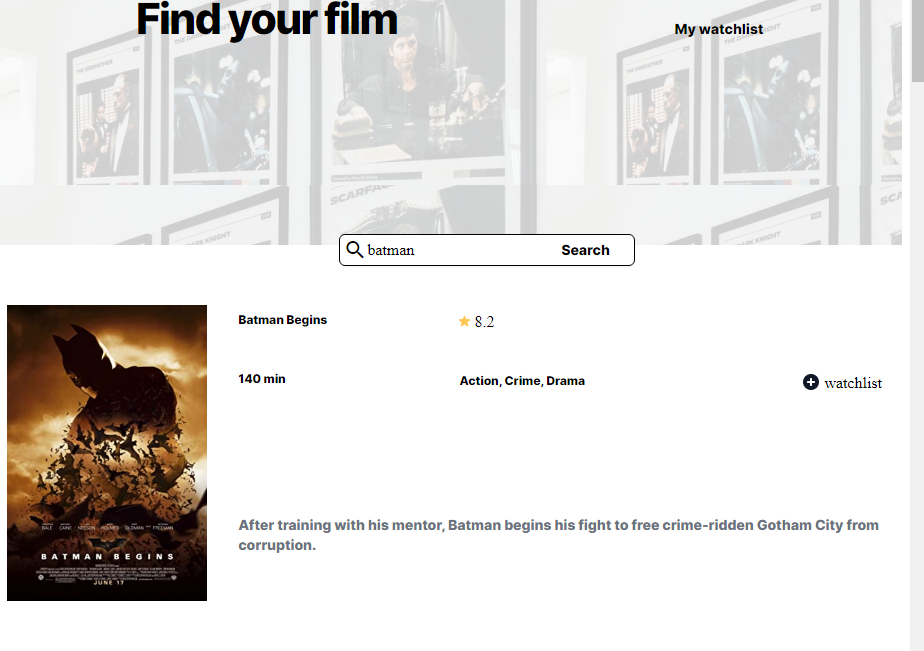

# movie-watchlist - scrimba project




This is my first complex project of scrimba front end path.
Typing in the search bar the title of the movie you are looking for it is possible to check if it is present in the list , read plot, rating and a few more info about. [OMDb Api](https://www.omdbapi.com/). Then, clicking on + button you can add the movie to your watchlist page. Once you want to delete the movie from the watchlist go to the  page clicking on the top right and press - button of the movie  you want to delete.
I've practised DOM, API, LOCALSTORAGE, CSS GRID

## Using movie app

To use the movie app, follow these steps:

```
press inside the search bar and type the title of the movie you are looking for
press the button search to check if the movie is part of the list
click on + button to add it to watchlist page
To check your watchlist page click on it on the top rigt of the page
If you want to delete a movie from a list click on - button on the movie card

```
You can find the app deployed on github pages at the address https://aline89b.github.io/movie-watchlist/.

## Contributing to movie app

To contribute to javascript library, follow these steps:

1. Fork this repository.
2. Create a branch: `git checkout -b main`.
3. Make your changes and commit them: `git commit -m '<commit_message>'`
4. Push to the original branch: `git push origin main`
5. Create the pull request.

Alternatively see the GitHub documentation on [creating a pull request](https://help.github.com/en/github/collaborating-with-issues-and-pull-requests/creating-a-pull-request).

## Contact

If you want to contact me you can reach me at <a.grianti89@gmail.com>.
